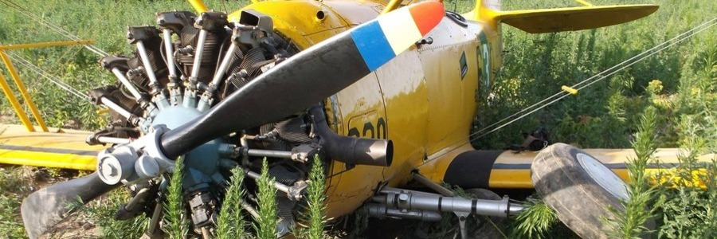
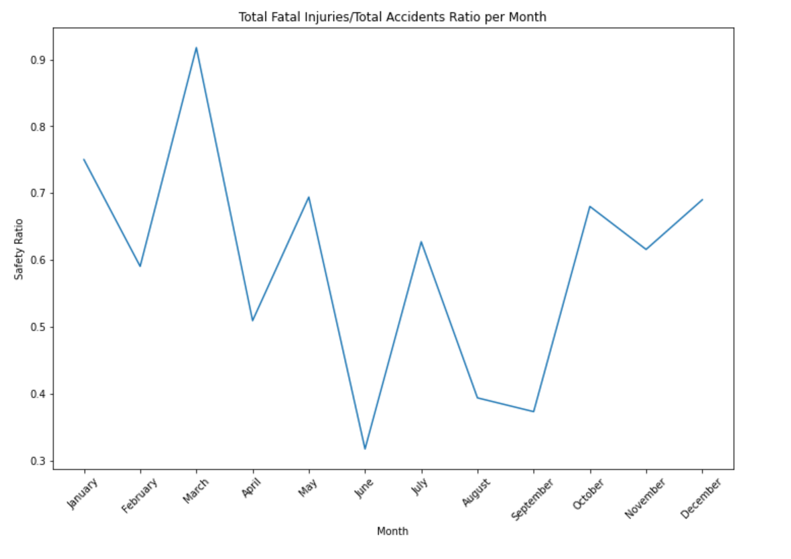
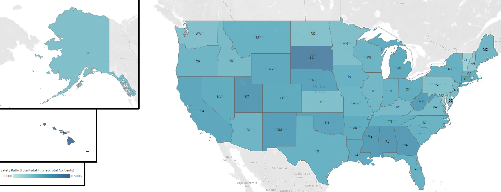
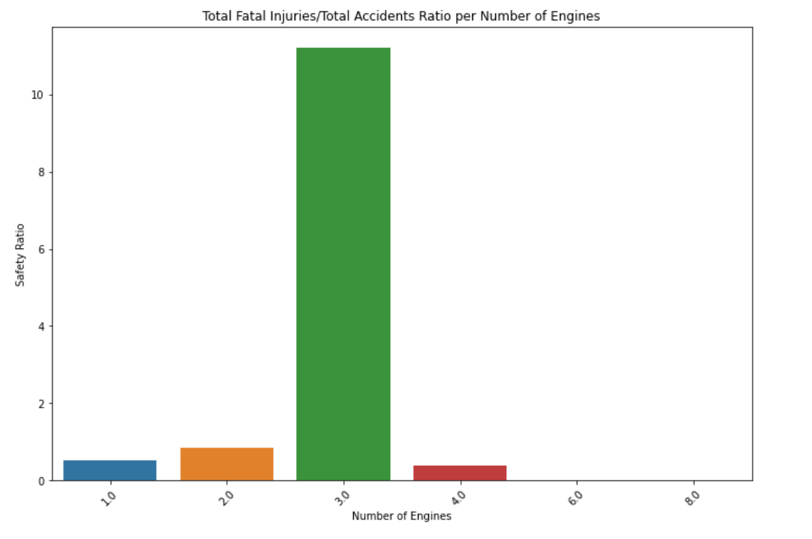

7

# Aircraft Risk Analysis

**Author**: Christopher Jimenez

## Business Understanding



To successfully expand in the area of aviation for both commercial and private uses, the company must mitigate potential risks of aircrafts. 
In doing so the company can make strategic and informative decisions on what to apply their attention to in order to have a successful practice in aviation, but more importantly keep our clients safe.

## Data Understanding

A [dataset](https://www.kaggle.com/datasets/khsamaha/aviation-accident-database-synopses) from the National Transportation Safety Board that includes aviation accident data from 1962 to 2023. Every aircraft in the data has an ID number to reference and includes information such as Make, Model, weather, purpose of flight and severity of injuries as an outcome.

## Data Preparation

The dataset was carefully cleaned to streamline its focus. Unnecessary columns were removed, and records before the year 2000 were filtered out. While NaNs in the 'Number of Engines' column were filled by the most occuring value, duplicates and other NaN values were cleared. Lastly a 'Safety Ratio' column is created by Total Fatal Injuries divided by the Total Accidents to measure the severity of accidents in relation to their occurrence.

The investigation zeroes in on three areas:

Time-based Analysis: Examining connections between accidents and weather conditions.

Location-based Analysis: Exploring accidents based on geographical location, specifically by state.

Engine Count and Aircraft Make: Investigating the correlation between the number of engines and the make of the plane and amount of accidents and fatal injuries

This approach ensures a clean and focused dataset for efficient analysis


## Exploratory Data Analysis

By determining the cumulative fatal injuries and subsequently dividing it by the total number of accidents, we obtain the safety ratio. Employing this metric on each area investigated, allows us to identify the higher risk areas that need more attention.
 





 


# Conclusion

## Recommendations

1: Time-Based Safety Measures:

Leverage the insights derived from the dataset's time analysis to implement time-specific safety measures. Identify months with historically higher safety ratios and focus on targeted training programs and operational enhancements during these periods, and enhance communication protocols to address seasonal challenges.

2: Regional Safety Initiatives:

Based on location-specific safety ratios, introduce region-specific safety initiatives. Collaborate with aviation authorities and local operators in states with lower safety ratios to address regional challenges. Share best practices, and tailor safety protocols to the unique characteristics of each location, thereby contributing to improved safety outcomes.

3: Engine Configuration Awareness:

Given the dataset's insights into the total fatal injuries, total accidents, and safety ratios; consider promoting the advantages of four-engine aircraft or higher in training modules and operational guidelines. Encourage the company to consider this information in their decision-making processes regarding fleet composition, maintenance planning, and overall risk mitigation strategies.

With these recommendations with the time, location, and engine configuration insights provided by the dataset, these measures aim to address potential risk areas within the aviation industry. This approach enhances the effectiveness of risk mitigation strategies, fostering a safe industry, and continuous improvement across different areas of aviation operations.

### Limitations

- Correlations identified in the dataset do not necessarily imply causation, other factors not considered in the dataset may influence accident patterns

- In aviation safety there are usually multiple factors at hand such as human error and mechanical maintenence.
 

### Next Steps
Deeper exploration may include more information to lower risks even more. Areas for futher exploration in the dataset include, weather, and purpose of flight.

Additionally, a new investigation of human factors or the occurances of maintenance could also show a higher or lower likelihood of accidents or sustained injuries.

# For More Information 

Provided are links to the [Jupyter Notebook](./Aircraft-Analysis-Notebook.ipynb), [Presentation](./Aircraft-Risk-Analysis-Presentation.pdf), and [Tableau](https://public.tableau.com/app/profile/christopher.jimenez8117/viz/AircraftRiskAnalysis/AircraftRiskAnalysis?publish=yes)

## Repository Structure

```
├── images
├── Aircraft-Analysis_Notebook.ipynb
├── Aircraft-Risk-Analysis-Presentation.pdf
├── README.md
└── __init__.py
```


