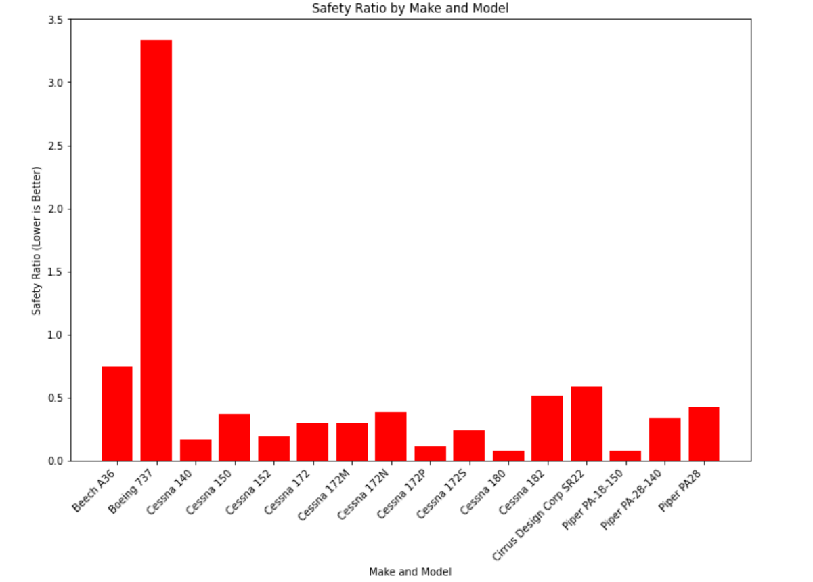
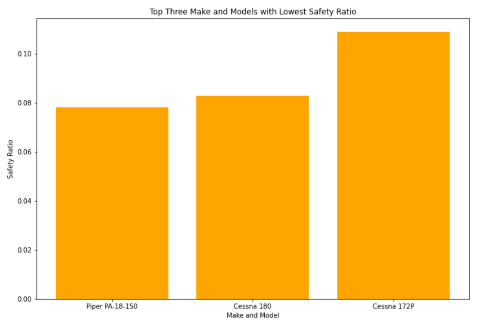

# Aircraft Risk Analysis

**Author**: Christopher Jimenez

## Business Understanding


To successfully expand in the area of aviation for both commercial and private uses, the company must mitigate potential risks of aircrafts. 
In doing so the company can make strategic and informative decisions on what to apply their attention to in order to have a successful practice in aviation, but more importantly keep our clients safe.

## Data Understanding

A dataset from the National Transportation Safety Board that includes aviation accident data from 1962 to 2023. Every aircraft in the data has an ID number to reference and includes information such as Make, Model, weather, purpose of flight and severity of injuries as an outcome.

## Data Preparation

The approach to the dataset is to focus on the accidents that occured after the year 2000, then specifically investigate the make and models of airplanes with at least 100 accidents. Focusing at the total fatal injuries and total accidents to create a safety ratio metric we can use to compare models of airplanes.

## Exploratory Data Analysis

By determining the cumulative fatal injuries for each make and model and subsequently dividing it by the total number of accidents, we obtain the safety ratio. Employing this metric allows us to identify the top three safest models per make and model.





# Conclusion

## Recommendations

After conducting an analysis on the total fatal injuries associated with the Make and Model of aircraft, the study has identified three specific Makes and Models with the least risk of fatalities.
Through these findings choosing one of these three should provide the lowest risk investment when starting the business endeavour.

1: Piper PA-18-150

2: Cessna 180

3: Cessna 172P

### Limitations

- The correlation between the model of aircraft and total fatal injury does not imply causation.

- In aviation safety there are usually multiple factors at hand not just the make and model such as human error
 

### Next Steps
Deeper exploration in the dataset may include more information to lower risks even more.Areas for futher exploration include: Geographical Impact, weather impact, and purpose of flight.
An analysis of each area could show a higher or lower likelihood of accidents or sustained injuries.

# For More Information 

Provided are links to the [Jupyter Notebook](./Aircraft-Analysis-Notebook.ipynb), [Presentation](./Aircraft-Risk-Analysis-Presentation.pdf), and [Tableau](https://public.tableau.com/app/profile/christopher.jimenez8117/viz/AircraftRiskAnalysis/AircraftRiskAnalysis?publish=yes)

## Repository Structure

```
├── images
├── Aircraft-Analysis_Notebook.ipynb
├── Aircraft-Risk-Analysis-Presentation.pdf
├── README.md
└── __init__.py
```


