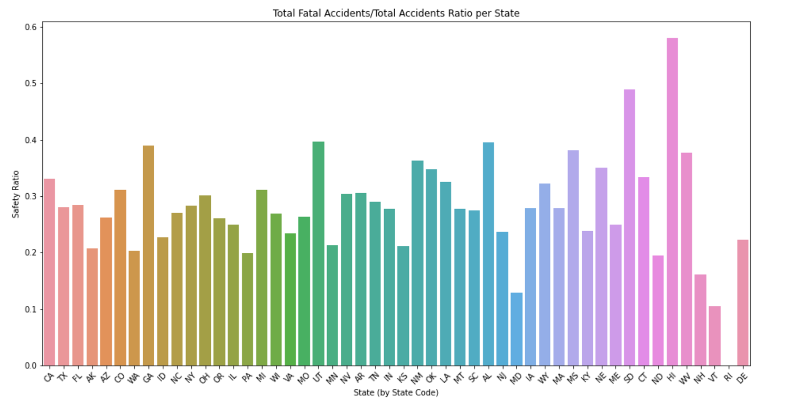

# Aircraft Risk Analysis

**Author**: Christopher Jimenez

## Business Understanding


To successfully expand in the area of aviation for both commercial and private uses, the company must mitigate potential risks of aircrafts. 
In doing so the company can make strategic and informative decisions on what to apply their attention to in order to have a successful practice in aviation, but more importantly keep our clients safe.

## Data Understanding

A [dataset](https://www.kaggle.com/datasets/khsamaha/aviation-accident-database-synopses) from the National Transportation Safety Board that includes aviation accident data from 1962 to 2023. Every aircraft in the data has an ID number to reference and includes information such as Make, Model, weather, purpose of flight and severity of injuries as an outcome.

## Data Preparation

The dataset was carefully cleaned to streamline its focus on airplanes. Unnecessary columns were removed, and records before the year 2010 were filtered out for more recent trends. While NaNs in the 'Number of Engines' column were filled by the most occuring value, duplicates and other NaN values were cleared. Lastly a 'Safety Ratio' column is created by Total Fatal Injuries divided by the Total Accidents to measure the severity of accidents in relation to their occurrence.

The investigation zeroes in on three areas:

Time-based Analysis: Examining connections of accidents and fatalities during the year by months.

Location-based Analysis: Exploring accidents and fatalities based on geographical location, specifically by state.

Engine Count and Aircraft Make: Investigating the correlation between the number of engines and the amount of accidents and fatalities. 

This approach ensures a clean and focused dataset for efficient analysis


## Exploratory Data Analysis

In each area of investigation graphs were made for Total Accidents, Total Fatal Injuries, and the Total Fatal Injuries/Total Accident Ratio labeled as "Safety Ratio". A deeper exploration into Makes of airplanes was included to specifically reinforce results found from the number of engine area of investigation. 

Employing this safety ratio metric on each area investigated, allows us to identify the higher and lower risk areas which gives us more insight to mitigate potential risks for future investments.
 
#### Time


#### Location



#### Number of Engines


# Conclusion

## Recommendations

1: Time-Based Safety Measures:

- Targeted training programs, extra safety procedures, or enhanced communication protocols

- Apply Successful measures from Winter and Spring months to improve safety in Summer season

Leverage the insights derived from the dataset's time analysis to implement time-specific safety measures. Months with historically higher safety ratios, specifically in the winter and spring seasons, can be focused on with targeted training programs and operational enhancements during these periods, and enhance communication protocols to address seasonal challenges. The results from the recommended measures can be then applied to summer months, reducing the overall total accidents.

2: Regional Safety Initiatives:

- Collaborate with aviation authorities and local operators in states with lower ratios
	
- Tailor safety protocols to address unique challenges in each region

Based on location-specific safety ratios, introduce region-specific safety initiatives. Collaborating with aviation authorities and local operators in states with lower safety ratios to address regional challenges. Sharing best practices, and tailoring safety protocols to the unique characteristics of each location, could contribute to improved safety outcomes. Applying the learned practices and protocols especially in high traffic areas such as California, Texas, and Florida could greatly reduce the amount of accidents and fatal injuries.

3: Engine Configuration Awareness:

- Consider purchasing airplane models with Four or more engines

- Multiple Engines have decreased the likelihood of accidents therefore less fatalities

Given the dataset's insights into the total accidents,total fatal injuries, and safety ratios; consider the advantages of four-engine aircraft or higher in training modules and operational guidelines. Highly encourage the company to consider this information in their decision-making processes regarding fleet composition, maintenance planning, and overall risk mitigation strategies.

With these recommendations with the time, location, and engine configuration insights provided by the dataset, these measures aim to address potential risk areas within the introduction of the aviation industry. This approach enhances the effectiveness of risk mitigation strategies, fostering a safe industry, and continuous improvement across different areas aviation operations.

### Limitations

- Correlations identified in the dataset do not necessarily imply causation, other factors not considered in the dataset may influence accident patterns

- In aviation safety there are usually multiple factors at hand such as human error and mechanical maintenence.
 

### Next Steps

Deeper exploration may include more information to lower risks even more. Areas for futher exploration in the dataset include, weather, and purpose of flight.

Additionally, a new investigation of human factors or the occurances of maintenance could also show a higher or lower likelihood of accidents or sustained injuries.

# For More Information 
To see more visualizations, please check the Jupyter Notebook and the Tableau Dashboard.
Provided are links to the [Jupyter Notebook](./Aircraft-Risk-Analysis-Notebook.ipynb), [Presentation](./Aircraft-Risk-Analysis-Presentation.pdf), and [Tableau](https://public.tableau.com/app/profile/christopher.jimenez8117/viz/AircraftRiskAnalysisProject/AnalysisDashboard?publish=yes)

## Repository Structure

```
├── images
├── Aircraft-Risk-Analysis-Notebook.ipynb
├── Aircraft-Risk-Analysis-Presentation.pdf
├── README.md
└── __init__.py
```


